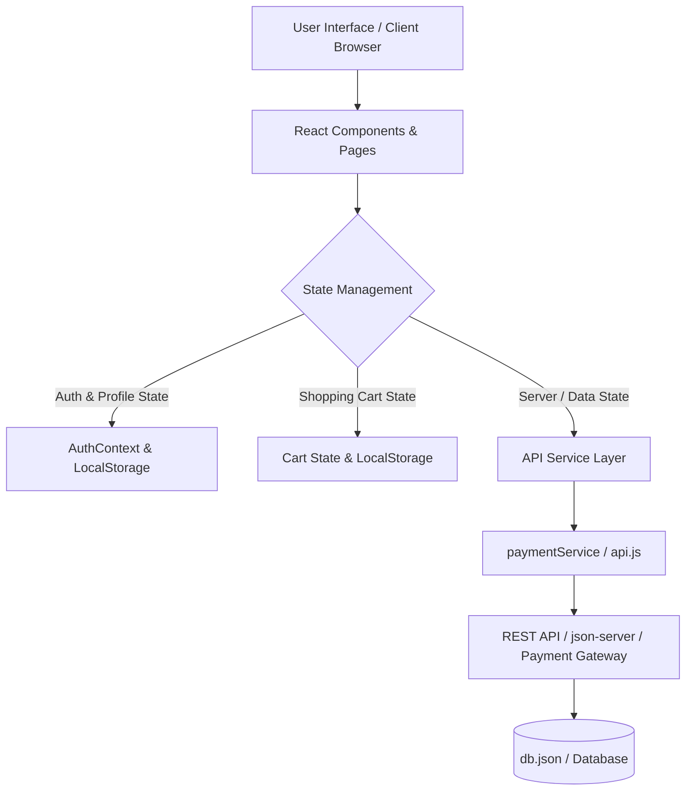
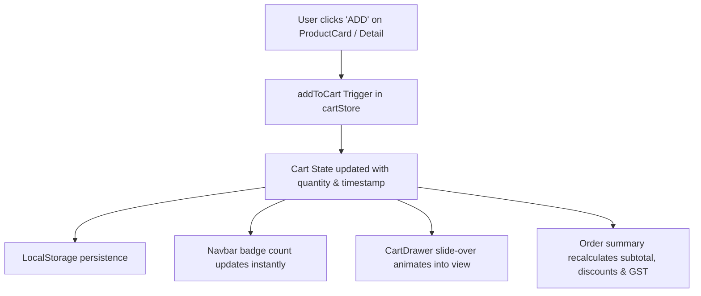
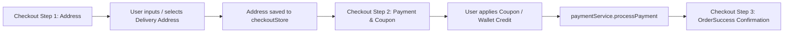

# Technical Architecture

## Overview
This project follows a modern, scalable React architecture with clear separation of concerns, making it easy to maintain, test, and integrate with any production backend (Node.js/Express, Python/Django, Go, or Firebase).

## System Architecture



## Key Architectural Decisions

### 1. State Management Separation
- **Client State**: Shopping Cart, User Session Authentication, Wishlist, and Checkout flow are managed via centralized Zustand stores (`src/stores/`) with automatic sync to `localStorage` for offline resilience.
- **Server State**: Configured for straightforward migration to TanStack Query / Axios querying REST API endpoints (`/products`, `/categories`, `/reviews`, `/orders`, `/wallet`).

### 2. Component-Based Architecture
- **Pages** (`src/pages/`): Handle route parameters, orchestrate child components, manage page metadata, and trigger cart/checkout actions. Step-based checkout is encapsulated in `src/pages/checkout/`.
- **Components** (`src/components/`): Modular domain-based hierarchy:
  - `layout/`: Shell elements (`Navbar`, `Footer`, `MobileBottomNav`, `CheckoutFooter`)
  - `common/`: Reusable UI primitives (`SEO`, `ResponsiveImage`, `ScallopDivider`, `TestimonialCard`)
  - `modals/`: Drawers & dialogs (`AuthModal`, `CartDrawer`, `UserAccountDrawer`, `AddressDrawer`)
  - `product/`: Product presentations (`ProductCard`, `ProductVisual`)
  - `checkout/`: Stepper & summary widgets (`CheckoutStepper`, `CheckoutOrderSummary`, `BrandPaymentSection`)
  - `graphics/`: High-performance vector illustrations & doodles (`KidsDoodles`, `CategorySVGs`, `PaymentLogos`, `PediatricDoctorIllustration`)

### 3. API & Payment Service Layer
- **Centralized Service Layer** (`src/services/`):
  - `paymentService.js`: Encapsulates Razorpay / UPI / NetBanking / COD processing logic, order creation, signature verification, and simulated delay responses.
  - `api.js` & `apiClient.js`: Standardized HTTP handler for product catalog, reviews, and coupon validation.
  - `authService.js` & `dbService.js`: Authentication simulation and mock persistence.

### 4. Folder Structure
```
src/
├── assets/          # Static brand assets
├── components/      # Domain-categorized reusable components
│   ├── layout/      # Navbar, Footer, MobileBottomNav, CheckoutFooter
│   ├── common/      # SEO, ResponsiveImage, ScallopDivider, TestimonialCard
│   ├── modals/      # AuthModal, CartDrawer, UserAccountDrawer, AddressDrawer
│   ├── product/     # ProductCard, ProductVisual
│   ├── checkout/    # CheckoutStepper, CheckoutOrderSummary, BrandPaymentSection
│   ├── graphics/    # KidsDoodles, CategorySVGs, PaymentLogos, PediatricDoctorIllustration
│   └── index.js     # Master component barrel export
├── constants/       # Centralized route paths and configuration
├── data/            # Static catalog & batch test reports
├── pages/           # Route views & checkout multi-step flows
│   └── checkout/    # AddressStep, PaymentStep, OrderSuccessStep
├── services/        # API client and payment gateway integration
├── stores/          # Zustand global state stores (auth, cart, checkout, wishlist)
├── utils/           # Helper formatters (currency, discounts)
├── App.jsx          # App root routing with Suspense & lazy loading
├── index.css        # Tailwind CSS v4 design tokens and utilities
└── main.jsx         # App entry point
```

## Data Flow

### 1. Cart Lifecycle Data Flow


### 2. Checkout & Payment Flow


## Performance Considerations
- **Tailwind CSS v4 Engine**: Zero-runtime CSS with compiled lightweight classes.
- **Optimized SVG Assets**: Vector graphics in `ProductVisual.jsx` load in 0ms with crisp rendering on Retina and 4K displays.
- **Responsive Layout**: Fluid breakpoints for 320px mobile up to 1440px desktop screens.
