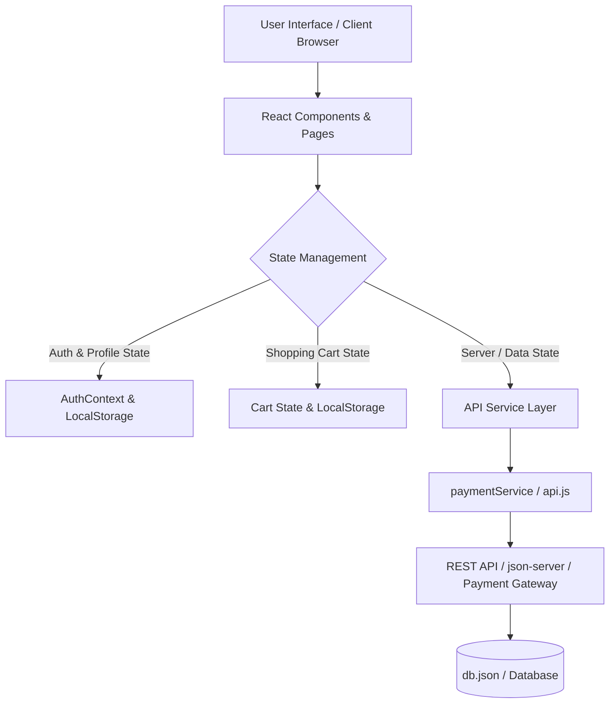
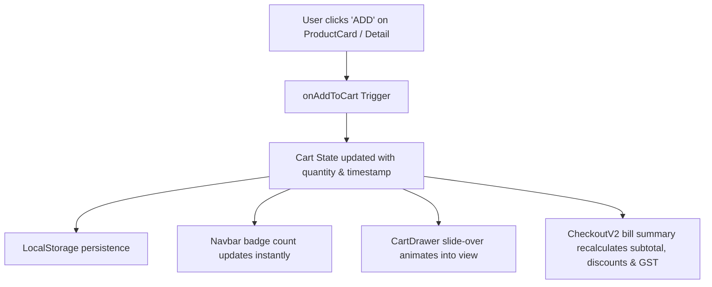

# Technical Architecture

## Overview
This project follows a modern, scalable React architecture with clear separation of concerns, making it easy to maintain, test, and integrate with any production backend (Node.js/Express, Python/Django, Go, or Firebase).

## System Architecture



## Key Architectural Decisions

### 1. State Management Separation
- **Client State**: Shopping Cart and User Session Authentication are managed cleanly via React Context and React Hooks with automatic sync to `localStorage` for offline resilience.
- **Server State**: Configured for straightforward migration to TanStack Query / Axios querying REST API endpoints (`/products`, `/categories`, `/reviews`, `/orders`, `/wallet`).

### 2. Component-Based Architecture
- **Pages** (`src/pages/`): Handle route parameters, orchestrate child components, manage page metadata, and trigger cart/checkout actions.
- **Components** (`src/components/`): Focused, reusable UI components (`Navbar`, `Footer`, `ProductCard`, `ProductVisual`, `AuthModal`, `CartDrawer`, `UserAccountDrawer`).
- **Visuals** (`src/components/ProductVisual.jsx`): Tailored SVG packaging visuals rendering realistic Nutrimix jars, gummy containers, and combos without external broken image dependencies.

### 3. API & Payment Service Layer
- **Centralized Service Layer**:
  - `src/services/paymentService.js`: Encapsulates Razorpay / UPI / NetBanking / COD processing logic, order creation, signature verification, and simulated delay responses.
  - `src/services/api.js`: Standardized HTTP handler for product catalog, reviews, and coupon validation.
- **Easy Backend Swap**: Changing `VITE_API_BASE_URL` in `.env` connects the frontend seamlessly from local `json-server` (`db.json`) to a live cloud production backend.

### 4. Folder Structure
```
src/
├── components/     # Reusable UI components
├── pages/          # Full page views matching ourlittlejoys.com
├── context/        # React Context providers (AuthContext)
├── services/       # Payment & API client services
├── data/           # Product datasets and fallback mock collections
├── assets/         # Static logos, badges, and illustrations
└── index.css       # Tailwind CSS v4 design tokens and utilities
```

## Data Flow

### 1. Cart Lifecycle Data Flow


### 2. Checkout & Payment Flow


## Performance Considerations
- **Tailwind CSS v4 Engine**: Zero-runtime CSS with compiled lightweight classes.
- **Optimized SVG Assets**: Vector graphics in `ProductVisual.jsx` load in 0ms with crisp rendering on Retina and 4K displays.
- **Responsive Layout**: Fluid breakpoints for 320px mobile up to 1440px desktop screens.
