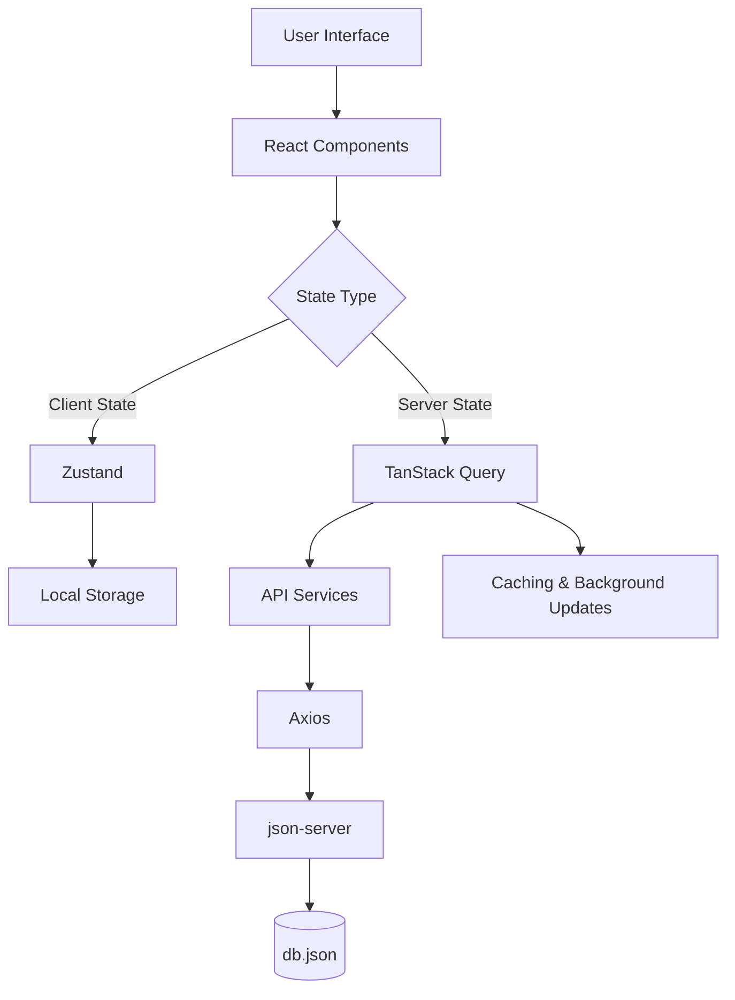
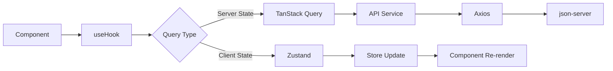
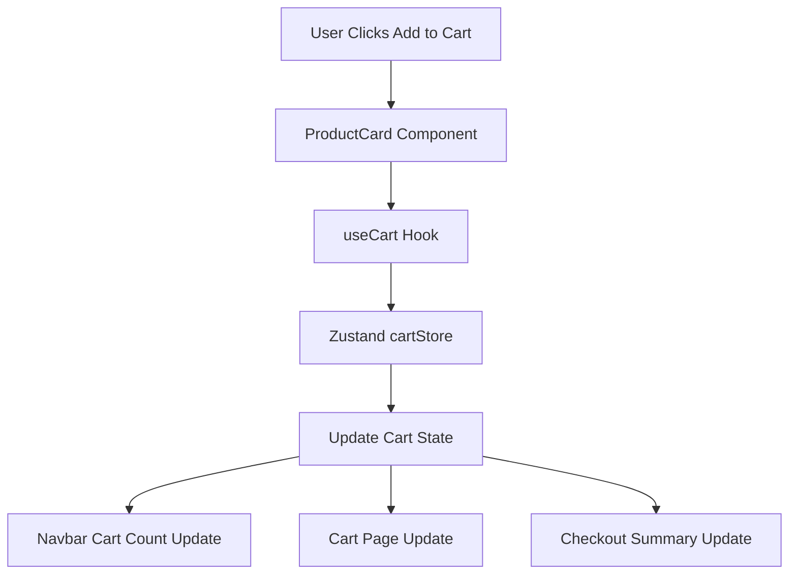

# 🧠 Vibe Coding Files: Complete Setup for AI-Assisted Development

Based on your request to use AI (Claude) for "vibe coding" your Little Joys clone project, here are the essential files you need to create before starting. These files provide the critical context that helps AI generate accurate, consistent code that follows your conventions.

## 📁 Essential Files for Vibe Coding

| File Name | Purpose | Importance |
|-----------|---------|------------|
| **CLAUDE.md** | Primary instructions for AI about project structure, conventions, and rules |  |
| **ARCHITECTURE.md** | Technical decisions, folder structure explanation, and system design |  |
| **RULES.md** | Specific rules for AI to follow (security, patterns, etc.) |  |
| **SCHEMA.md** | Data models, API contracts, and database structure documentation |  |
| **README.md** | Project overview, setup instructions, and basic documentation |  |
| **package.json** | Project dependencies, scripts, and metadata |  |
| **vite.config.js** | Vite build configuration for React |  |
| **tailwind.config.js** | Tailwind CSS configuration and theme setup |  |
| **.env.example** | Environment variable template (without actual secrets) |  |
| **db.json** | Mock data structure for your project (for json-server) |  |

## 🚀 Quick Start: Files to Create First

Create these files in your project root directory before starting your AI coding session:

```bash
little-joys-clone/
├── CLAUDE.md              # AI context file - MOST IMPORTANT
├── ARCHITECTURE.md        # Technical decisions
├── RULES.md               # AI guidelines
├── SCHEMA.md              # Data models
├── README.md              # Project overview
├── package.json           # Dependencies
├── vite.config.js         # Build configuration
├── tailwind.config.js     # Tailwind setup
├── .env.example           # Environment template
└── db.json                # Mock data
```

<details>
<summary>📁 Complete Project Structure</summary>

```
little-joys-clone/
│
├── CLAUDE.md              # AI instructions and context
├── ARCHITECTURE.md        # Technical architecture
├── RULES.md               # AI coding rules
├── SCHEMA.md              # Data schemas
├── README.md              # Project documentation
├── package.json           # Dependencies and scripts
├── vite.config.js         # Vite configuration
├── tailwind.config.js     # Tailwind CSS setup
├── .env.example           # Environment variables template
├── db.json                # Mock data for json-server
│
├── public/                # Static files
├── src/                   # Source code
│   ├── components/        # Reusable components
│   │   ├── ui/            # Basic UI components
│   │   ├── navbar/        # Navigation components
│   │   ├── product/       # Product-related components
│   │   └── common/        # Common components
│   │
│   ├── pages/             # Page components
│   │   ├── Home/          # Home page
│   │   ├── Shop/          # Shop listing
│   │   ├── Product/       # Product details
│   │   ├── Cart/          # Cart page
│   │   ├── Login/         # Login/Signup
│   │   └── Profile/       # User profile
│   │
│   ├── layouts/           # Layout components
│   ├── stores/            # Zustand stores
│   │   ├── cartStore.js   # Cart state
│   │   ├── authStore.js   # User authentication
│   │   └── wishlistStore.js # Wishlist state
│   │
│   ├── services/          # API services
│   │   ├── api.js         # Axios instance
│   │   ├── productService.js # Product API
│   │   └── authService.js # Authentication API
│   │
│   ├── hooks/             # Custom hooks
│   ├── schemas/           # Zod validation schemas
│   ├── lib/               # Utility functions
│   ├── routes/            # Route configurations
│   ├── App.jsx            # Main app component
│   └── main.jsx           # Entry point
│
└── .gitignore             # Git ignore rules
```

</details>

## 📄 File Contents & Templates

### 1. **CLAUDE.md** - AI Context File (MOST IMPORTANT)

This is the most critical file for vibe coding. It tells Claude about your project structure, conventions, and current status.

```markdown
# Little Joys Clone - AI Context

## Project Overview
Modern e-commerce platform for baby/kids products built with React and a focus on performance, user experience, and clean architecture.

## Tech Stack
- **Frontend**: React 18 with Vite
- **Styling**: Tailwind CSS + shadcn/ui
- **State Management**: Zustand (client state) + TanStack Query (server state)
- **Forms**: React Hook Form + Zod validation
- **HTTP Client**: Axios
- **Icons**: Lucide React
- **Animations**: Motion (formerly Framer Motion)
- **Notifications**: Sonner
- **Mock Backend**: json-server
- **Code Quality**: ESLint + Prettier
- **Version Control**: Git + GitHub
- **Deployment**: Vercel

## Current Phase
Day 1 of 5: Setting up foundation and basic components

## Folder Structure
- `src/components/` - Reusable UI components
- `src/pages/` - Page components
- `src/layouts/` - Layout components
- `src/stores/` - Zustand stores
- `src/services/` - API service layer
- `src/hooks/` - Custom hooks
- `src/schemas/` - Zod validation schemas
- `src/lib/` - Utility functions
- `src/routes/` - Route configurations

## Coding Conventions
- Use functional components with hooks (no class components)
- Prefer TypeScript-style typing even in JavaScript files
- Use named exports over default exports
- Keep components focused and under 200 lines
- Use Tailwind classes for styling (avoid inline styles)
- Use `use client` directive for client-only logic in Next.js-like projects
- Implement proper error boundaries
- Use suspense for data fetching with TanStack Query

## Mock Backend Setup
- json-server running on port 3001
- Main endpoints: `/products`, `/categories`, `/reviews`, `/users`, `/orders`
- Data stored in `db.json` at project root

## What to Build Next
1. Basic layout with Navbar and Footer
2. Home page hero section
3. Category cards component
4. Product card component
5. Responsive design implementation

## API Service Layer Pattern
All API calls should be made through service files:
- `services/api.js` - Axios instance with interceptors
- `services/productService.js` - Product-related API calls
- `services/authService.js` - Authentication API calls
- `services/cartService.js` - Cart-related API calls

## State Management Patterns
- **Client State (Zustand)**: Cart, user auth, wishlist, UI preferences
- **Server State (TanStack Query)**: Products, categories, reviews, orders

## Example Component Structure
```jsx
// Example: ProductCard.jsx
import { useState } from 'react';
import { useCart } from '@/stores/cartStore';
import { Button } from '@/components/ui/button';
import { Card } from '@/components/ui/card';
import { toast } from 'sonner';

export function ProductCard({ product }) {
  const { addToCart } = useCart();
  const [isAdding, setIsAdding] = useState(false);

  const handleAddToCart = async () => {
    setIsAdding(true);
    try {
      await addToCart(product.id);
      toast.success('Added to cart');
    } catch (error) {
      toast.error('Failed to add to cart');
    } finally {
      setIsAdding(false);
    }
  };

  return (
    <Card className="group relative overflow-hidden rounded-xl border-border/40 bg-card shadow-sm transition-all hover:shadow-md">
      {/* Product image */}
      {/* Product info */}
      {/* Add to cart button */}
    </Card>
  );
}
```

## Current Status
- [x] Project setup completed
- [x] Dependencies installed
- [ ] Basic layout with Navbar/Footer
- [ ] Home page components
- [ ] Shop page implementation
- [ ] Product details page
- [ ] Cart functionality
- [ ] User authentication
```

### 2. **ARCHITECTURE.md** - Technical Architecture

```markdown
# Technical Architecture

## Overview
This project follows a modern React architecture with clear separation of concerns, making it easy to maintain and extend.

## System Architecture



## Key Architectural Decisions

### 1. State Management Separation
**Decision**: Split state between Zustand (client) and TanStack Query (server)
**Rationale**: 
- Client state changes frequently and doesn't need caching
- Server state benefits from TanStack Query's caching, background updates, and optimistic updates
**Implementation**:
- Zustand stores: Cart, user authentication, wishlist, UI preferences
- TanStack Query hooks: Products, categories, reviews, orders

### 2. Component-Based Architecture
**Decision**: Use small, focused components with composition
**Rationale**: Better reusability, easier testing, and clearer code organization
**Pattern**: 
- Container components (data fetching, state management)
- Presentational components (UI only, receive data via props)

### 3. API Service Layer
**Decision**: Centralized API service layer with Axios
**Rationale**: 
- Easy to swap backend (mock to real API)
- Consistent error handling
- Type safety with TypeScript-style JSDoc
**Structure**:
- `services/api.js` - Axios instance with interceptors
- Domain-specific services (productService, authService, etc.)

### 4. Folder Structure
```
src/
├── components/     # Reusable components
├── pages/          # Page components
├── layouts/        # Layout components
├── stores/         # Zustand stores
├── services/       # API services
├── hooks/          # Custom hooks
├── schemas/        # Zod validation schemas
├── lib/            # Utility functions
└── routes/         # Route configurations
```

## Data Flow

### 1. Component Data Flow


### 2. Cart Data Flow


## Performance Considerations
- React.lazy for code splitting
- Memoization with React.memo and useMemo
- Virtualization for long lists
- Image optimization with lazy loading
- Bundle analysis and optimization
```

### 3. **RULES.md** - AI Coding Rules

```markdown
# AI Coding Rules

## Security Rules
- Never hardcode API keys, secrets, or database passwords in code
- Use environment variables for all sensitive configuration
- Validate all user inputs on both client and server side
- Implement proper authentication and authorization checks
- Sanitize user-generated content before display

## Code Style Rules
- Use TypeScript-style typing even in JavaScript files
- Prefer functional components with hooks over class components
- Use early returns for better readability
- Keep components under 200 lines - split if larger
- Use descriptive variable names (avoid single letters)
- Add JSDoc comments for functions and components
- Use async/await over .then() chains
- Implement proper error boundaries

## Pattern Rules
- Use repository pattern for data access
- Implement factory pattern for component creation
- Use observer pattern for state updates
- Follow component composition over inheritance
- Use custom hooks for reusable logic
- Implement proper cleanup in useEffect

## Anti-Patterns to Avoid
- Prop drilling (use Zustand or Context instead)
- Inline styles (use Tailwind classes)
- Direct DOM manipulation (use refs)
- Giant components with multiple responsibilities
- Unnecessary re-renders (use React.memo, useMemo, useCallback)
- Magic numbers (use constants)
- Deeply nested components (flatten when possible)

## Testing Rules
- Write tests alongside implementation
- Use React Testing Library for component tests
- Mock API calls in tests
- Test edge cases and error conditions
- Aim for at least 80% code coverage

## Documentation Rules
- Update CLAUDE.md when significant changes are made
- Add JSDoc comments for complex functions
- Update README.md for setup changes
- Document any architectural decisions

## Performance Rules
- Use React.lazy for code splitting
- Implement virtualization for long lists
- Optimize images with lazy loading
- Minimize bundle size
- Use proper memoization techniques
```

### 4. **SCHEMA.md** - Data Schemas

```markdown
# Data Schemas

## Product Schema
```javascript
{
  id: string,           // Unique identifier
  name: string,         // Product name
  slug: string,         // URL-friendly identifier
  description: string,  // Detailed description
  category: string,     // Category ID
  price: number,        // Current price
  mrp: number,          // Maximum retail price
  discount: number,     // Discount percentage
  rating: number,       // Average rating (0-5)
  reviewCount: number,  // Number of reviews
  image: string,        // Main image URL
  images: string[],     // Array of image URLs
  stock: number,        // Available quantity
  ageGroup: string,     // Recommended age group
  benefits: string[],   // List of benefits
  ingredients: string,  // Ingredients list
  nutritionalInfo: object, // Nutritional information
  isBestSeller: boolean, // Best seller flag
  isNew: boolean,       // New arrival flag
  createdAt: string,    // Creation timestamp
  updatedAt: string     // Last update timestamp
}
```

## Category Schema
```javascript
{
  id: string,           // Unique identifier
  name: string,         // Category name
  slug: string,         // URL-friendly identifier
  description: string,  // Category description
  image: string,        // Category image URL
  productCount: number, // Number of products
  order: number         // Display order
}
```

## User Schema
```javascript
{
  id: string,           // Unique identifier
  name: string,         // User's full name
  email: string,        // Email address
  phone: string,        // Phone number
  password: string,     // Hashed password
  avatar: string,       // Avatar URL
  addresses: [{         // Array of addresses
    id: string,
    label: string,      // Home, Work, etc.
    line1: string,
    line2: string,
    city: string,
    state: string,
    pincode: string,
    isDefault: boolean
  }],
  wallet: {             // Wallet information
    balance: number,
    currency: string,
    transactions: [{
      id: string,
      type: string,     // credit, debit
      amount: number,
      description: string,
      timestamp: string
    }]
  },
  orders: [string],     // Array of order IDs
  wishlist: [string],   // Array of product IDs
  createdAt: string,
  updatedAt: string
}
```

## Cart Schema
```javascript
{
  userId: string,       // User ID (or 'guest' for logged out users)
  items: [{             // Array of cart items
    productId: string,  // Product ID
    quantity: number,   // Quantity
    addedAt: string     // Timestamp when added
  }],
  couponCode: string,   // Applied coupon code
  discount: number,     // Discount amount
  subtotal: number,     // Subtotal before discount
  total: number,        // Total after discount
  updatedAt: string     // Last update timestamp
}
```

## Order Schema
```javascript
{
  id: string,           // Unique identifier
  userId: string,       // User ID
  items: [{             // Array of order items
    productId: string,  // Product ID
    quantity: number,   // Quantity
    price: number,      // Price at time of purchase
    name: string,       // Product name
    image: string       // Product image
  }],
  shippingAddress: {    // Shipping address
    line1: string,
    line2: string,
    city: string,
    state: string,
    pincode: string,
    country: string
  },
  paymentMethod: string, // Payment method used
  paymentStatus: string, // Payment status
  orderStatus: string,  // Order status (pending, confirmed, shipped, delivered)
  total: number,        // Total amount
  discount: number,     // Discount amount
  createdAt: string,
  updatedAt: string
}
```

## Review Schema
```javascript
{
  id: string,           // Unique identifier
  productId: string,    // Product ID
  userId: string,       // User ID
  rating: number,       // Rating (1-5)
  title: string,        // Review title
  comment: string,      // Review comment
  createdAt: string,
  updatedAt: string
}
```

## API Response Schemas
```javascript
// Success response
{
  success: true,
  data: T,            // Response data
  message: string     // Optional message
}

// Error response
{
  success: false,
  error: {
    code: string,     // Error code
    message: string,  // Error message
    details: object   // Additional details
  }
}
```
```

### 5. **package.json** - Dependencies

```json
{
  "name": "little-joys-clone",
  "private": true,
  "version": "0.1.0",
  "type": "module",
  "scripts": {
    "dev": "vite",
    "build": "vite build",
    "lint": "eslint . --ext js,jsx --report-unused-disable-directives --max-warnings 0",
    "preview": "vite preview",
    "format": "prettier --write .",
    "json-server": "json-server --watch db.json --port 3001"
  },
  "dependencies": {
    "@tanstack/react-query": "^5.80.6",
    "axios": "^1.7.9",
    "framer-motion": "^11.15.0",
    "lucide-react": "^0.454.0",
    "react": "^18.3.1",
    "react-dom": "^18.3.1",
    "react-hook-form": "^7.53.0",
    "react-router-dom": "^6.26.2",
    "sonner": "^1.7.1",
    "zod": "^3.23.8",
    "zustand": "^4.5.5",
    "class-variance-authority": "^0.7.1",
    "clsx": "^2.1.1",
    "tailwind-merge": "^2.5.4"
  },
  "devDependencies": {
    "@types/react": "^18.3.3",
    "@types/react-dom": "^18.3.0",
    "@vitejs/plugin-react": "^4.3.1",
    "autoprefixer": "^10.4.19",
    "eslint": "^8.57.0",
    "eslint-plugin-react": "^7.34.1",
    "eslint-plugin-react-hooks": "^4.6.0",
    "eslint-plugin-react-refresh": "^0.4.7",
    "json-server": "^0.17.4",
    "postcss": "^8.4.38",
    "prettier": "^3.3.2",
    "tailwindcss": "^3.4.3",
    "vite": "^5.4.0"
  }
}
```

### 6. **vite.config.js** - Vite Configuration

```javascript
import { defineConfig } from 'vite'
import react from '@vitejs/plugin-react'
import path from 'path'

// https://vitejs.dev/config/
export default defineConfig({
  plugins: [react()],
  resolve: {
    alias: {
      '@': path.resolve(__dirname, './src'),
    },
  },
  server: {
    port: 3000,
    open: true,
    proxy: {
      '/api': {
        target: 'http://localhost:3001',
        changeOrigin: true,
        rewrite: (path) => path.replace(/^\/api/, ''),
      },
    },
  },
  build: {
    outDir: 'dist',
    sourcemap: true,
  },
})
```

### 7. **tailwind.config.js** - Tailwind Configuration

```javascript
/** @type {import('tailwindcss').Config} */
export default {
  darkMode: ['class'],
  content: ['./index.html', './src/**/*.{js,jsx,ts,tsx}'],
  theme: {
    container: {
      center: true,
      padding: '2rem',
      screens: {
        '2xl': '1400px',
      },
    },
    extend: {
      colors: {
        border: 'hsl(var(--border))',
        input: 'hsl(var(--input))',
        ring: 'hsl(var(--ring))',
        background: 'hsl(var(--background))',
        foreground: 'hsl(var(--foreground))',
        primary: {
          DEFAULT: 'hsl(var(--primary))',
          foreground: 'hsl(var(--primary-foreground))',
        },
        secondary: {
          DEFAULT: 'hsl(var(--secondary))',
          foreground: 'hsl(var(--secondary-foreground))',
        },
        destructive: {
          DEFAULT: 'hsl(var(--destructive))',
          foreground: 'hsl(var(--destructive-foreground))',
        },
        muted: {
          DEFAULT: 'hsl(var(--muted))',
          foreground: 'hsl(var(--muted-foreground))',
        },
        accent: {
          DEFAULT: 'hsl(var(--accent))',
          foreground: 'hsl(var(--accent-foreground))',
        },
        popover: {
          DEFAULT: 'hsl(var(--popover))',
          foreground: 'hsl(var(--popover-foreground))',
        },
        card: {
          DEFAULT: 'hsl(var(--card))',
          foreground: 'hsl(var(--card-foreground))',
        },
      },
      borderRadius: {
        lg: 'var(--radius)',
        md: 'calc(var(--radius) - 2px)',
        sm: 'calc(var(--radius) - 4px)',
      },
      keyframes: {
        'accordion-down': {
          from: { height: 0 },
          to: { height: 'var(--radix-accordion-content-height)' },
        },
        'accordion-up': {
          from: { height: 'var(--radix-accordion-content-height)' },
          to: { height: 0 },
        },
      },
      animation: {
        'accordion-down': 'accordion-down 0.2s ease-out',
        'accordion-up': 'accordion-up 0.2s ease-out',
      },
    },
  },
  plugins: [require('tailwindcss-animate')],
}
```

### 8. **.env.example** - Environment Variables

```bash
# API Configuration
VITE_API_BASE_URL=http://localhost:3001/api

# Firebase Configuration (if using)
VITE_FIREBASE_API_KEY=your_api_key
VITE_FIREBASE_AUTH_DOMAIN=your_project.firebaseapp.com
VITE_FIREBASE_PROJECT_ID=your_project_id
VITE_FIREBASE_STORAGE_BUCKET=your_project.appspot.com
VITE_FIREBASE_MESSAGING_SENDER_ID=your_sender_id
VITE_FIREBASE_APP_ID=your_app_id

# Payment Gateway (if using)
VITE_RAZORPAY_KEY_ID=your_key_id

# Analytics (if using)
VITE_GOOGLE_ANALYTICS_ID=your_ga_id

# Feature Flags
VITE_ENABLE_WALLET=true
VITE_ENABLE_WISHLIST=true
VITE_ENABLE_REVIEWS=true

# Environment
VITE_ENVIRONMENT=development
```

### 9. **db.json** - Mock Data Structure

```json
{
  "products": [
    {
      "id": "1",
      "name": "Nutrimix Chocolate",
      "slug": "nutrimix-chocolate",
      "description": "Delicious chocolate-flavored nutritional supplement for kids",
      "category": "nutrimix",
      "price": 599,
      "mrp": 649,
      "discount": 8,
      "rating": 4.6,
      "reviewCount": 128,
      "image": "https://example.com/images/nutrimix-chocolate.jpg",
      "images": [
        "https://example.com/images/nutrimix-chocolate-1.jpg",
        "https://example.com/images/nutrimix-chocolate-2.jpg"
      ],
      "stock": 45,
      "ageGroup": "2-5 years",
      "benefits": ["Immunity booster", "Brain development", "Better digestion"],
      "ingredients": "Milk solids, cocoa powder, vitamins, minerals",
      "nutritionalInfo": {
        "protein": "12g",
        "carbohydrates": "35g",
        "fats": "8g",
        "vitamins": ["A", "C", "D", "B12"],
        "minerals": ["Iron", "Zinc", "Calcium"]
      },
      "isBestSeller": true,
      "isNew": false,
      "createdAt": "2026-09-01T10:00:00Z",
      "updatedAt": "2026-09-10T15:30:00Z"
    }
    // Add 15-20 more products
  ],
  "categories": [
    {
      "id": "1",
      "name": "Nutrimix",
      "slug": "nutrimix",
      "description": "Nutritional supplements for overall growth",
      "image": "https://example.com/images/nutrimix-category.jpg",
      "productCount": 8,
      "order": 1
    }
    // Add more categories
  ],
  "users": [
    {
      "id": "1",
      "name": "Test User",
      "email": "user@example.com",
      "phone": "+91 98765 43210",
      "password": "$2a$10$92IXUNpkjO0rOQ5byMi.Ye4oKoEa3Ro9llC/.og/at2x2OqIWC5bW",
      "avatar": "https://ui-avatars.com/api/?name=Test+User",
      "addresses": [
        {
          "id": "1",
          "label": "Home",
          "line1": "123 Main St",
          "line2": "Apt 4B",
          "city": "Mumbai",
          "state": "Maharashtra",
          "pincode": "400001",
          "isDefault": true
        }
      ],
      "wallet": {
        "balance": 350,
        "currency": "INR",
        "transactions": [
          {
            "id": "1",
            "type": "credit",
            "amount": 50,
            "description": "Cashback",
            "timestamp": "2026-09-10T12:30:00Z"
          }
        ]
      },
      "orders": ["1"],
      "wishlist": ["1", "3"],
      "createdAt": "2026-09-01T10:00:00Z",
      "updatedAt": "2026-09-10T15:30:00Z"
    }
  ],
  "reviews": [
    {
      "id": "1",
      "productId": "1",
      "userId": "1",
      "rating": 5,
      "title": "Great product!",
      "comment": "My kid loves the taste and I've seen improvement in immunity.",
      "createdAt": "2026-09-05T14:20:00Z",
      "updatedAt": "2026-09-05T14:20:00Z"
    }
  ],
  "orders": [
    {
      "id": "1",
      "userId": "1",
      "items": [
        {
          "productId": "1",
          "quantity": 2,
          "price": 599,
          "name": "Nutrimix Chocolate",
          "image": "https://example.com/images/nutrimix-chocolate.jpg"
        }
      ],
      "shippingAddress": {
        "line1": "123 Main St",
        "line2": "Apt 4B",
        "city": "Mumbai",
        "state": "Maharashtra",
        "pincode": "400001",
        "country": "India"
      },
      "paymentMethod": "UPI",
      "paymentStatus": "completed",
      "orderStatus": "delivered",
      "total": 1198,
      "discount": 100,
      "createdAt": "2026-09-08T10:15:00Z",
      "updatedAt": "2026-09-10T16:45:00Z"
    }
  ]
}
```

## 🚀 How to Use These Files with Claude

1. **Start a new conversation with Claude**
2. **Upload or reference your CLAUDE.md file** - This is the most important step
3. **Describe what you want to build** in natural language
4. **Claude will generate code** that follows your conventions
5. **Review and refine** the generated code
6. **Update CLAUDE.md** as your project evolves

## 💡 Pro Tips for Vibe Coding

1. **Start Small**: Begin with simple components before complex pages
2. **Be Specific**: The more details you provide, the better the results
3. **Iterate**: Don't expect perfect code immediately - provide feedback
4. **Use Examples**: Include code examples in your CLAUDE.md for patterns you like
5. **Version Control**: Commit regularly so you can rollback if needed
6. **Test Early**: Write tests alongside implementation
7. **Document Changes**: Update your documentation files as you build

## 🔧 Next Steps

1. Create all these files in your project root
2. Install dependencies: `npm install`
3. Start json-server: `npm run json-server`
4. Start your React app: `npm run dev`
5. Begin your AI coding session with Claude

Would you like me to:
1. **Generate a complete CLAUDE.md** tailored to your specific project?
2. **Create db.json** with 15-20 realistic baby product entries?
3. **Design the folder structure** for your React components?
4. **Provide example prompts** for common vibe coding scenarios?